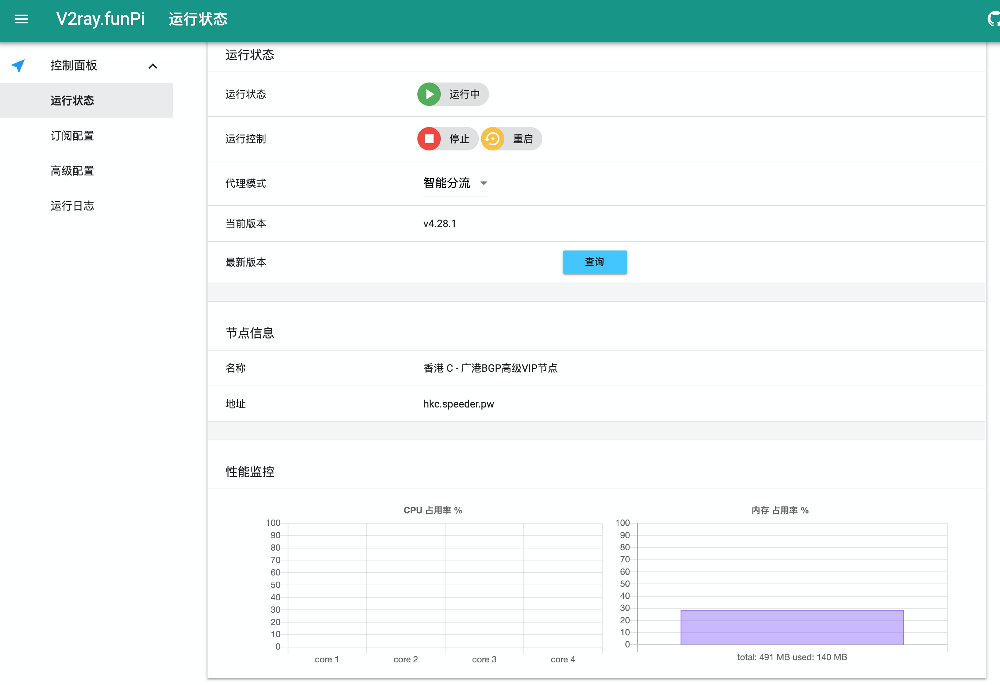
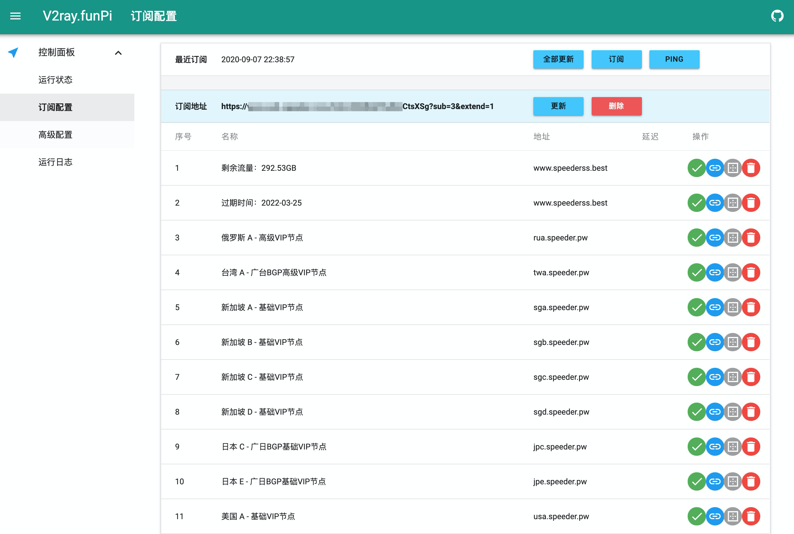
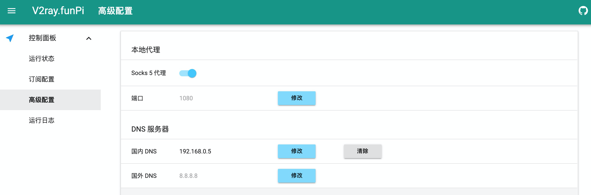
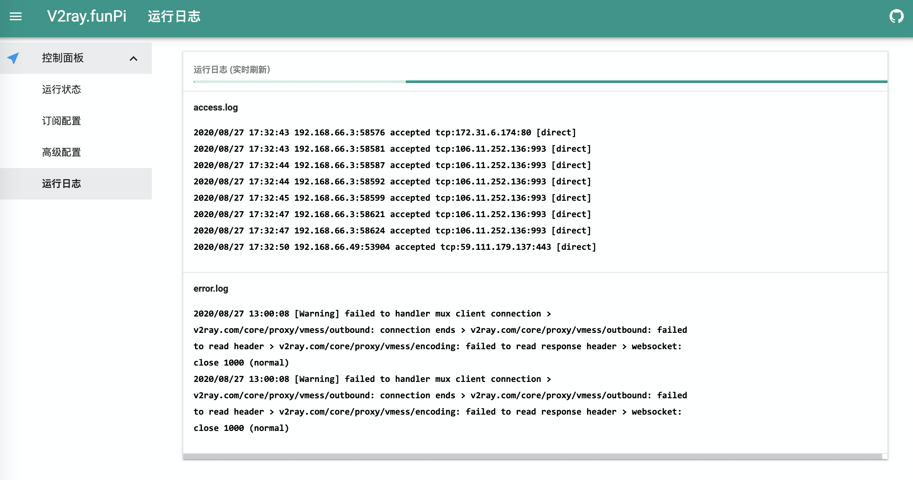
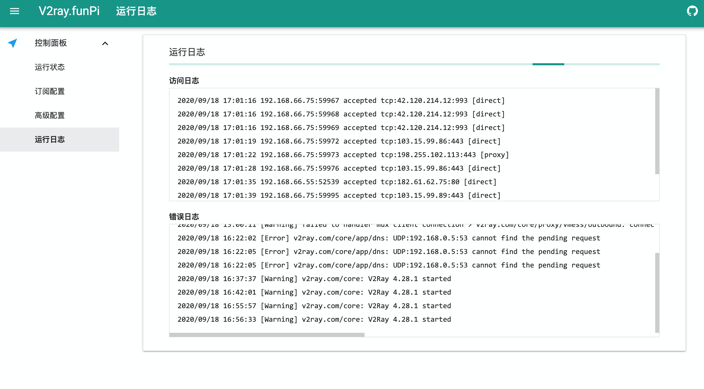

## 简介

一个基于 Web 的 V2ray 控制面板，已改造为将树莓派作为旁路由使用，只需要设置好网关，即可代理路由器下所有设备透明翻墙，支持直连\智能分流\全局代理 三种模式，并能自动管理订阅，原理参考 [透明代理(TPROXY)
](https://guide.v2fly.org/app/tproxy.html)，TG讨论组:[https://t.me/v2ray_funpi](https://t.me/v2ray_funpi)

  

  

  

  

  

## 系统支持
MacOS  
Debian Buster  
Raspberry Pi OS (based on Debian Buster)  
Armbian (based on Debian Buster)


## 硬件支持
Mac  
Raspberry Pi 4B  
[ZeroPi](http://wiki.friendlyarm.com/wiki/index.php/ZeroPi)  
斐讯 N1  
其他任何运行 Debian Buster 的arm、x86、x64 主机/虚拟机/Docker镜像 

  

  

## 安装方式
### Mac
```
# 安装 brew
ruby -e "$(curl -fsSL https://raw.githubusercontent.com/Homebrew/install/master/install)"

# clone 代码
cd ~/Documents/
git clone https://github.com/twotreesus/V2ray.FunPi.git V2ray.Fun
cd V2ray.Fun

# 安装依赖
./script/install_osx.sh

# 运行
python3 app.py

```
浏览器输入127.0.0.1:1086，即可访问面板  
浏览器设置 socks5 代理 127.0.0.1:1080，即可使用，Chrome 浏览器推荐使用 SwitchyOmega  

### Debian Buster
```
sudo su - root
cd /usr/local
git clone https://github.com/twotreesus/V2ray.FunPi.git V2ray.Fun
cd V2ray.Fun/script
./install.sh
```

重启服务

```
sudo supervisorctl restart v2ray.fun
```

设置树莓派为旁路由，树莓派修改为静态地址192.168.66.200，这里路由器是192.168.66.1
```
sudo nano /etc/dhcpcd.conf

# Example static IP configuration:
interface eth0
static ip_address=192.168.66.200/24
static routers=192.168.66.1
static domain_name_servers=192.168.66.1
```

重启树莓派
```
sudo reboot
```

然后设置路由器的DHCP网关为 192.168.66.200


配置完成，浏览器输入192.168.66.200:1086，即可访问面板

### Docker
Docker镜像目前支持amd64和arm64平台，感谢[raydoom](https://github.com/raydoom)提供支持，镜像已上传到dockerhub，可直接拉取使用，如需要也可以用根目录下的Dockerfile自行编译镜像

```
docker run -d --restart=unless-stopped --name=v2ray-funpi -p 1080:1080 -p 1086:1086 raydoom/v2ray-funpi
```

浏览器输入DOCKER_HOST_IP:1086，即可访问面板  
其中，DOCKER_HOST_IP为docker主机ip地址  
浏览器设置 socks5 代理 DOCKER_HOST_IP:1080，即可使用，Chrome 浏览器推荐使用 SwitchyOmega  

## 修改启动配置
修改配置文件，以设置面板用户名、密码，端口，其他设置均可在面板内完成，ps：配置文件内不支持注释

```
sudo nano /usr/local/V2ray.Fun/config/app_config.json

{
    "py/object": "core.app_config.AppConfig",
    "user": "admin",
    "password": "admin",
    "port": 1086,
    "proxy_mode": 1,
    "inited": true
}
```

修改完成后重启服务即可
```
sudo supervisorctl restart v2ray.fun
```

## 系统更新
因为目前是源码方式运行，暂不提供按特定版本更新的特性，需要手动登录后台ssh来更新，参考一下步骤（具体更新内容见TG群）：

```
sudo supervisorctl stop v2ray.fun
sudo git pull
sudo pip3 install -r script/requirements.txt
sudo supervisorctl start v2ray.fun
```